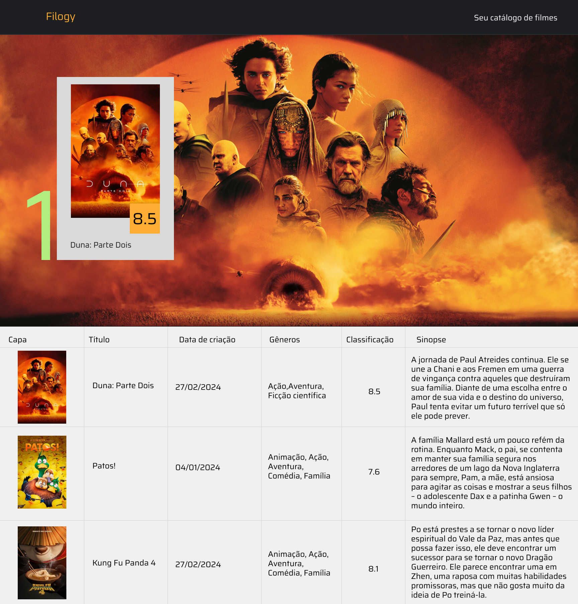

# Filogy

É o seu catálogo de filmes online, projetado para que você possa conhecer um filme antes de assisti-lo. Na plataforma você pode encontrar o resumo da história, sua classificação - de acordo com opinião dos telespectadores, quando foi ou será lançado e seus gêneros.

Com o Filogy a descoberta de um bom filme fica mais fácil e permite uma ótima experiência. 

## Interface

A interface do Filogy é simples e poderosa, com ela é possível achar os seus filmes baseados na classificação, título, data, ou até mesmo por um trecho de texto existente na sinopse do filme. Fazendo com que seja mais simples encontrar um bom filme para assistir.

## Forma de execução

Para executar a aplicação basta acessar o diretório do projeto: `cd filogy`. Após isso, devemos executar o comando: `npm install`, para que possamos instalar todas as dependências da aplicação.

Em seguida, para executar a aplicação utilizaremos o comando: `npm start`. E com isso, a aplicação será executada no modo de desenvolvimento. Após a execução do comando basta abrir [http://localhost:3000](http://localhost:3000) para visualizá-lo em seu navegador.
